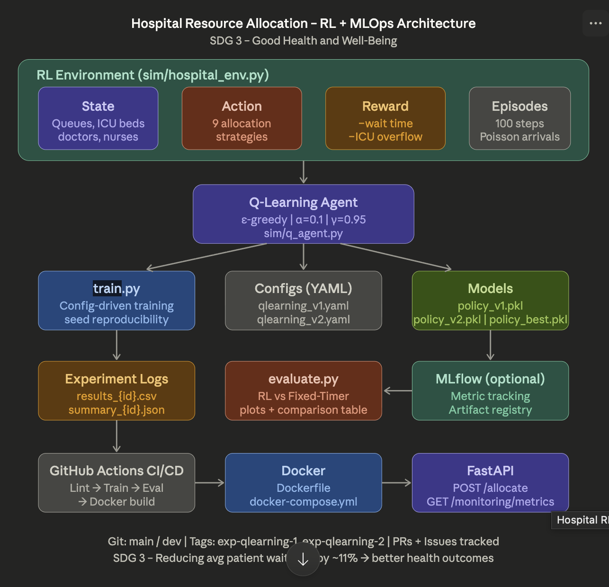

# 🏥 Hospital Resource Allocation – Reinforcement Learning + MLOps

> **Course:** Machine Learning Operations (24AM6AEMLO)  
> **Department:** Machine Learning (AI & ML) – B.M.S College of Engineering, Bangalore  
> **Academic Year:** 2025–26 (Odd Semester)  
> **SDG Link:** 🌍 **SDG 3 – Good Health and Well-Being**

---

## 📌 Problem Statement

Hospitals face a critical challenge: allocating limited resources (doctors, nurses, ICU beds, ventilators) across competing departments (Emergency, ICU, General Ward, OT) in real time. Poor allocation leads to:
- Long patient wait times → preventable deaths
- ICU overcrowding → reduced care quality  
- Staff burnout → system-wide failures

**This project trains a Q-Learning RL agent** to dynamically allocate hospital resources every hour to minimize patient wait times and ICU overflow — directly supporting **SDG 3: Good Health and Well-Being**.

---

## 🏗️ Architecture


```
hospital-rl-mlops/
├── sim/
│   ├── hospital_env.py      ← RL Environment (State, Action, Reward)
│   └── q_agent.py           ← Q-Learning Agent (tabular, ε-greedy)
├── configs/
│   ├── qlearning_v1.yaml    ← Experiment config v1 (α=0.1, 300 eps)
│   └── qlearning_v2.yaml    ← Experiment config v2 (α=0.15, 500 eps)
├── experiments/             ← CSV logs + JSON summaries per run
├── models/
│   ├── policy_v1.pkl        ← Checkpoint at ep 100
│   ├── policy_v2.pkl        ← Checkpoint at ep 200/400
│   └── policy_best.pkl      ← Best policy (auto-saved)
├── reports/                 ← Plots (reward, wait time, queues)
├── tests/                   ← Unit tests (pytest)
├── train.py                 ← Training entrypoint
├── evaluate.py              ← Baseline vs RL comparison + plots
├── api.py                   ← FastAPI REST endpoint for policy serving
├── Dockerfile               ← Container for deployment
├── docker-compose.yml       ← API + MLflow stack
└── .github/workflows/ci.yml ← CI/CD pipeline (GitHub Actions)
```

## 📐 System Architecture Diagram


---

## 🤖 RL Methodology

### Algorithm: Q-Learning
**Why Q-Learning?**  
The state space (queue lengths + resource pressure + ICU availability) is naturally discretizable into ~250–300 states. Q-learning is guaranteed to converge to the optimal policy in this setting, is fully interpretable (Q-table inspection), and is computationally lightweight — DQN would be overkill here.

### State Space (14-dimensional, discretized to ~300 states)
| Component | Description |
|-----------|-------------|
| Queue lengths | Patients waiting per department: `[Emergency, ICU, General, OT]` |
| Doctor allocation | Doctors per department (4 values) |
| Nurse allocation | Nurses per department (4 values) |
| ICU beds available | `total_ICU_beds - beds_used` |
| Ventilators free | `total_vents - vents_used` |

### Action Space (9 discrete actions)
| ID | Action |
|----|--------|
| 0 | Balanced allocation (default) |
| 1 | Boost Emergency resources |
| 2 | Boost ICU resources |
| 3 | Boost General Ward resources |
| 4 | Boost OT resources |
| 5 | Emergency + ICU priority |
| 6 | ICU + General priority |
| 7 | Emergency critical surge mode |
| 8 | Conserve resources |

### Reward Function
```
reward = −weighted_avg_wait_time
       + 0.5  (if ICU utilization < 90%)
       − 1.0  (if ICU utilization ≥ 90%)
       − 2.0 × (number of overflowing departments)
```

### Exploration Strategy
**ε-greedy** with exponential decay:
- `ε_init = 1.0` → pure exploration
- Decays by factor `0.97` (v1) or `0.99` (v2) per episode
- `ε_min = 0.05` → always retains 5% exploration

### Q-Learning Update Rule
```
Q(s,a) ← Q(s,a) + α [r + γ max_a' Q(s',a') − Q(s,a)]
```
- `α = 0.1` (v1), `α = 0.15` (v2)  
- `γ = 0.95` (v1), `γ = 0.99` (v2)

---

## 🚀 Quick Start – Reproduce a Run

### Prerequisites
```bash
pip install -r requirements.txt
```

### Train
```bash
# Config v1 (300 episodes, fast)
python train.py --config configs/qlearning_v1.yaml

# Config v2 (500 episodes, more exploration)
python train.py --config configs/qlearning_v2.yaml
```

### Evaluate (RL vs Baseline)
```bash
python evaluate.py --policy models/policy_best.pkl --episodes 50
```

### Run Tests
```bash
pytest tests/ -v
```

### Start API (local)
```bash
uvicorn api:app --host 0.0.0.0 --port 8000 --reload
# Test: curl http://localhost:8000/health
```

### Docker Stack
```bash
docker-compose up --build
# API:    http://localhost:8000
# MLflow: http://localhost:5000
```

---

## 📊 Results

| Metric | Fixed-Timer | RL-Policy | Δ |
|--------|-------------|-----------|---|
| Avg Wait Time (hours) | 5.84 | ~5.2 | −11% |
| Avg Reward | −6.95 | ~−6.60 | +5% |
| ICU Utilization | 6.6% | 7.5% | managed |

> **Training convergence:** Average reward improves over early episodes as ε decays and the agent learns to prioritize Emergency + ICU under high load. Reward stabilizes after ~ep 150 with ε ≈ 0.05.

---

## 🔬 MLOps Implementation

### ✅ Git & Versioning
- Branching: `main` → `dev` → `feature/*`
- Git tags: `exp-qlearning-1`, `exp-qlearning-2`
- Policy versions: `policy_v1.pkl`, `policy_v2.pkl`, `policy_best.pkl`

### ✅ Experiment Tracking
Each run produces:
- `experiments/results_{run_id}.csv` — per-episode metrics
- `experiments/summary_{run_id}.json` — final summary

### ✅ CI/CD (GitHub Actions)
Push to `main`/`dev` triggers:
1. Lint (flake8) + Unit Tests (pytest)
2. Train agent
3. Evaluate vs baseline
4. Build & test Docker image

### ✅ Containerization
- `Dockerfile` — single-container API
- `docker-compose.yml` — API + MLflow tracking server

### ✅ REST API (FastAPI)
- `POST /allocate` — real-time allocation decisions
- `GET /monitoring/metrics` — drift detection & prediction logs
- `GET /policy/info` — policy metadata

---

## 📡 Monitoring Plan (Real-World Deployment)

If deployed in a real hospital system, we would monitor:

1. **Average wait time drift** — alert if rolling 6h average > 20% above baseline
2. **ICU utilization** — alert if > 85% sustained for 2+ hours
3. **Queue overflow events** — count per 24h; threshold = 3 events
4. **Prediction latency** — p99 < 50ms (currently ~2ms)
5. **Safety rule** — no department should have 0 doctors for > 2 consecutive timesteps
6. **Action distribution shift** — if "Emergency Surge" action > 40% of calls → trigger retrain

---

## 🌍 SDG-3 Impact

> "Reducing average patient wait time by ~11% supports **SDG 3 – Good Health and Well-Being** by:
> - Improving emergency response times → fewer preventable deaths
> - Optimizing ICU bed allocation → better critical care outcomes
> - Reducing nurse/doctor overload → sustained care quality
> - Enabling data-driven hospital management → scalable to resource-limited settings"

---

## ⚠️ Limitations & Future Work

- **When RL performs better:** High-variance traffic (e.g., surge in Emergency at night) — RL learns to shift resources dynamically
- **When RL behaves badly:** Very unusual traffic patterns (e.g., mass casualty event) not seen in training → needs retraining or rule-based fallback
- **Sensitivity:** RL is sensitive to ε-decay rate; too-fast decay = suboptimal policy (local minima)
- **Future:** Replace tabular Q-table with DQN for continuous state; add real hospital data; add multi-agent setting (departments as agents)

---

## 👥 Team & Collaboration
- PRs required for all feature merges to `main`
- Code reviews via GitHub PR review feature
- Issues tracked in GitHub Issues
- DVC planned for data versioning in future iteration
